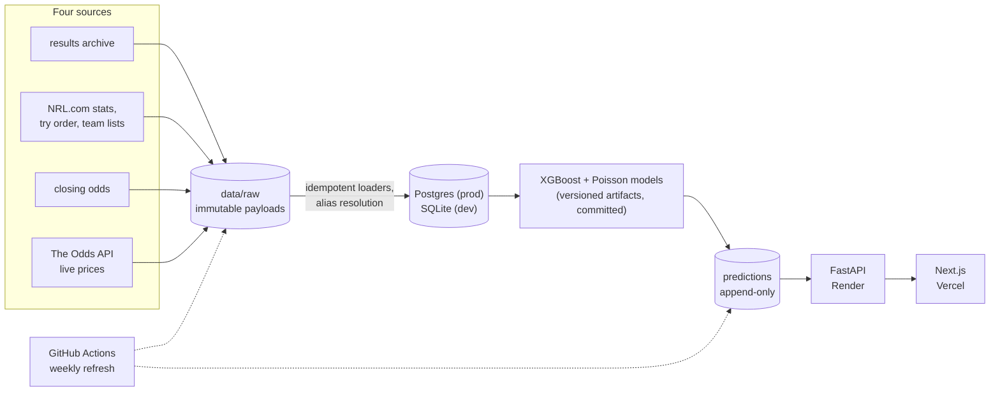

# GenPicks

[](https://github.com/mcdonalds532/genpicks/actions/workflows/ci.yml)

Machine-learning predictions for NRL matches: win probabilities, anytime
try-scorer and first try-scorer probabilities per player, converted to implied
betting odds and compared against live market prices.

**Live at [genpicks.vercel.app](https://genpicks.vercel.app)** — full data
pipeline (2016–2026, four sources), trained models, serving API, Next.js
frontend, live market odds, and official team lists driving the player
markets, refreshed weekly by GitHub Actions. GitHub sign-in with a
Stripe test-mode demo paywall gates the player try-scorer markets.

Headline numbers on the held-out 2024–26 test seasons:

- match winner: **0.6454 log loss — level with the bookmaker closing odds
  (0.6454) — and ahead on accuracy, 65.0% vs 62.8%** (Elo-only 0.6533,
  always-home 0.6821), 557 matches
- the fixed split is backed by walk-forward validation
  (`python -m genpicks.ml.validate`: one retrain per season 2022–26 on
  strictly earlier data, [report](data/models/walkforward.json)) — pooled
  0.6352 vs 0.6150 for the market, which was much sharper in 2022–23;
  the model closes the gap as training data grows and is ahead in 2026
- first try scorer: top-1 hit rate 9.0%, top-3 24.3% (uniform lineup: 2.9%),
  534 matches with verified try order
- anytime try: log loss 0.4253 over 20,396 player-appearances, well
  calibrated below 50%

The [track record page](https://genpicks.vercel.app/track-record) shows the
backtest match by match — cumulative log loss against the market, a
calibration plot, per-season breakdown — and the
[methodology page](https://genpicks.vercel.app/methodology) explains how
the models work in plain language.

## Architecture



- **Data pipeline** (Python): scrapers write raw payloads to `data/raw/`, an
  idempotent transform validates and loads them into the relational schema.
  The clean database is always rebuildable from raw. Loaders prefetch their
  lookup tables per season and skip no-op rewrites, so the weekly refresh
  spends ~400 SQL statements, not ~19,000 — minutes instead of an hour
  against a database an ocean away.
- **Database** (PostgreSQL in production, SQLite for local dev): normalized
  schema in `src/genpicks/db/models.py`, migrations via Alembic. Teams,
  venues, and players each have alias tables so differently-named source
  records (sponsor renames, "J. Tedesco" vs "James Tedesco") resolve to one
  canonical entity.
- **Models** (XGBoost / Poisson): match winner, team try rates, player try
  share; calibrated probabilities benchmarked against bookmaker closing odds.
  Match-winner features cover Elo, form, rest, city-level travel, and lineup
  availability from the official team lists; every prediction ships with its
  SHAP factors, rendered as a "why this price" panel on the match page.
- **Team lists**: officially named lineups ingested from NRL.com each week;
  predictions regenerate append-only when a projected lineup is superseded
  by the official one — the win probability sharpens too, since lineup
  availability is a model feature.
- **Odds ingestion**: The Odds API (free tier, 11 Australian bookmakers),
  polled into timestamped raw snapshots and replayed into `odds_snapshots`;
  aussportsbetting.com closing odds for the historical benchmark. (TAB and
  Betfair AU geo-block non-Australian IPs; polling them directly is a
  deployment-time option from an AU host.)
- **Serving**: FastAPI reads precomputed rows from `predictions`; Next.js
  frontend on Vercel. Weekly refresh via GitHub Actions.

## Local setup

```powershell
py -3.11 -m venv .venv
.venv\Scripts\python -m pip install -e ".[dev]"
copy .env.example .env
.venv\Scripts\alembic upgrade head   # creates data/genpicks.db
.venv\Scripts\python -m pytest
```

To use Postgres instead, start it (`docker compose up -d db` or a free
Neon/Supabase instance) and set `GENPICKS_DATABASE_URL` in `.env`.

## Pipeline commands

```powershell
# download raw pages (cache-first; resumable; ~1h per source first time)
.venv\Scripts\python -m genpicks.scrape --seasons 2016-2026
.venv\Scripts\python -m genpicks.scrape --source nrl --seasons 2016-2026
# aussportsbetting closing odds: manual browser download to data\raw\asb\nrl.xlsx
# (the site is Cloudflare-protected; see src/genpicks/scrape/asb.py)

# load into the database — order matters: rlp creates canonical rows,
# nrl attaches stats/try order, asb attaches closing odds
.venv\Scripts\python -m genpicks.ingest --seasons 2016-2026
.venv\Scripts\python -m genpicks.ingest --source nrl --seasons 2016-2026
.venv\Scripts\python -m genpicks.ingest --source asb --seasons 2016-2026

# train (writes versioned artifacts + evaluation reports to data/models/)
.venv\Scripts\python -m genpicks.ml.train
.venv\Scripts\python -m genpicks.ml.train_tries

# weekly in-season: official team lists + live market odds
# (odds need GENPICKS_ODDS_API_KEY in .env — free key from the-odds-api.com)
.venv\Scripts\python -m genpicks.scrape --source nrl-teamlists --seasons 2026
.venv\Scripts\python -m genpicks.scrape --source oddsapi
.venv\Scripts\python -m genpicks.ingest --source nrl-teamlists --seasons 2026
.venv\Scripts\python -m genpicks.ingest --source oddsapi

# score upcoming fixtures (append-only predictions table) and serve
.venv\Scripts\python -m genpicks.ml.predict
.venv\Scripts\uvicorn genpicks.api.main:app

# frontend (web/): expects the API; set API_URL if not on :8000
cd web; npm install; npm run dev
```

## Deployment

| Piece | Where | Notes |
|---|---|---|
| Frontend | Vercel | root directory `web/`, `API_URL` env pointing at the API |
| API | Render (free tier, Docker) | `Dockerfile` at repo root; serving-only image, honors `$PORT`; needs `GENPICKS_DATABASE_URL` |
| Database | Neon Postgres (Sydney) | seeded once via `pg_dump`/`pg_restore` from a fully-ingested local Postgres |
| Refresh | GitHub Actions | `.github/workflows/weekly-refresh.yml` |
| Keep-warm | GitHub Actions | `.github/workflows/keep-warm.yml` pings `/health` every 10 min |

The weekly workflow runs Monday 22:00 UTC (settles the finished round's
results) and Wednesday 22:00 UTC (official team lists + fresh odds), then
rescores upcoming fixtures. It needs two repo secrets:
`GENPICKS_DATABASE_URL` and `GENPICKS_ODDS_API_KEY`. Every step is
idempotent, so manual `workflow_dispatch` runs are always safe. Model
artifacts are committed to the repo (< 1 MB per version), so CI scoring
loads them straight from checkout — training stays a local, deliberate act.

Free-tier trade-off: the Render instance sleeps after ~15 minutes idle and
cold-starts in under a minute. The keep-warm workflow pings `/health` every
10 minutes to absorb that (one always-on instance fits inside the free
tier's 750 monthly hours); GitHub cron can lag, so the occasional slow
first load still happens.

The API logs one JSON line per request (method, path, status, duration)
and routes uvicorn's own output through the same formatter, so Render's
log stream is uniformly parseable. Setting `GENPICKS_SENTRY_DSN` in the
API environment turns on Sentry error reporting; unset, errors still land
in the logs with full tracebacks.

## Accounts and the demo paywall

Sign-in is GitHub OAuth via Auth.js (JWT sessions; users live in the same
Postgres schema, synced through an internal API endpoint). Match win
probabilities and the track record are free; the player try-scorer markets
sit behind a **demo subscription paywall**, enforced in the API itself —
the public endpoint withholds those markets unless the request proves an
entitled viewer, so the paywall can't be bypassed by calling the API
directly.

**The checkout is a demonstration, permanently in Stripe test mode.** No
real payments are possible: selling model picks for real money is regulated
territory, and this is a portfolio project. Use Stripe's test card
`4242 4242 4242 4242` (any future expiry/CVC) to walk the full flow:
hosted checkout → webhook (`checkout.session.completed`) → subscription
flag in Postgres → markets unlock. Env: the web app needs `AUTH_SECRET`,
`AUTH_GITHUB_ID`/`AUTH_GITHUB_SECRET`, and `GENPICKS_INTERNAL_API_KEY`
(shared with the API); the API additionally takes
`GENPICKS_STRIPE_SECRET_KEY`, `GENPICKS_STRIPE_PRICE_ID`, and
`GENPICKS_STRIPE_WEBHOOK_SECRET`. The checkout endpoint refuses to run
with anything but an `sk_test_` key, so the paywall stays a demo by
construction.

## Roadmap

1. ~~Foundations: repo, schema, migrations~~
2. ~~Data pipeline: scrapers, raw landing zone, validated transforms, backfill ~10 seasons~~
3. ~~Match-winner model with calibration, backtested against bookmaker closing odds~~
4. ~~Try-scorer models (team Poisson rates × player shares; first-try derived)~~
5. ~~FastAPI serving layer with batch prediction jobs~~
6. ~~Next.js frontend: fixtures, match detail, prediction track record~~
7. ~~Live odds (The Odds API) with model-vs-market display; official team lists~~
8. ~~Auth + Stripe subscription gating~~
9. ~~Deployment (Neon + Render + Vercel + weekly GitHub Actions refresh)~~
10. ~~Responsible-gambling disclaimer page, docs polish~~

> GenPicks is a portfolio project for educational purposes and does not
> provide betting advice.
